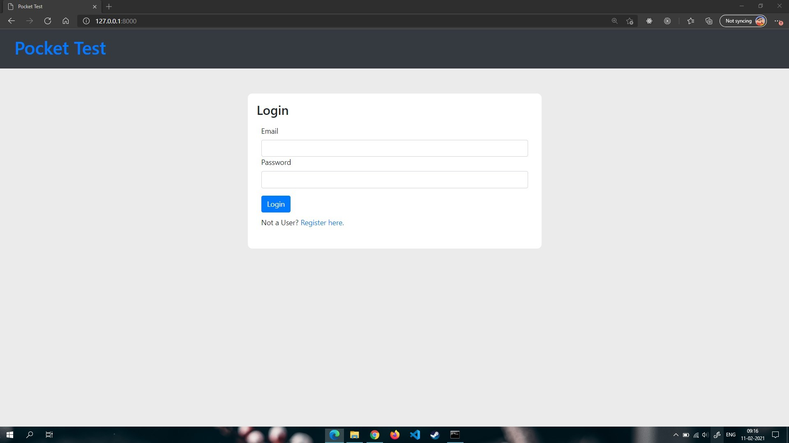
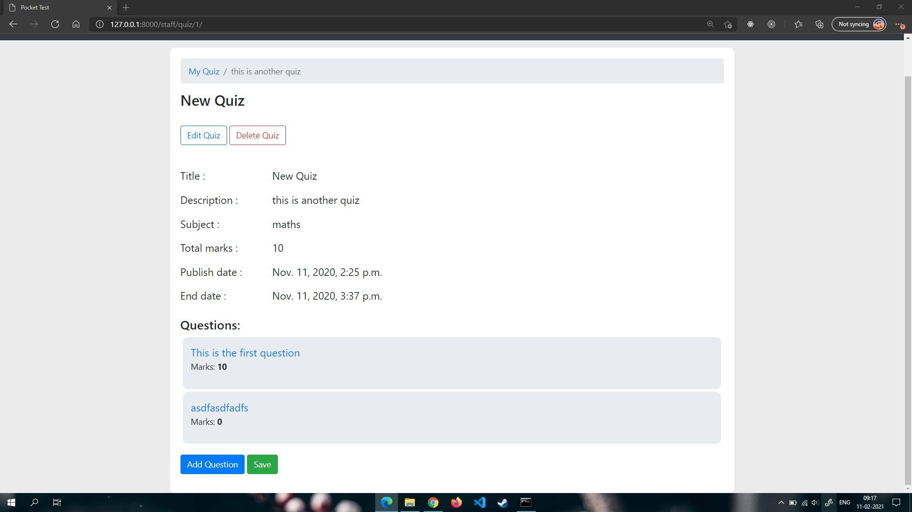

# PocketTest


[](https://python.org)


## A dedicated server for PocketTest Andriod App

## A dedicated website for staff members along with RESTful APIs for client.

## Screenshots for staff website







## Running the project locally

```

git clone --depth https://github.com/vikS7/PocketTestServer.git
cd PocketTestServer

```
Install the dependencies:

```

pip install -r requirements.txt

```

Create database and run development server

```

python manage.py makemigrations
python manage.py migrate

```

Create superuser login for admin site

```

python manage.py createsuperser

```


Run development server

```

python manage.py runserver

```


The project will be availabe at http://127.0.0.1:8000

## Available Webiste routes

`admin` - Admin page\
`staff/quizlist` - Homepage\
`staff/quiz/add` - Add new Quiz\
`staff/userupdate` - Updates user\
`staff/logout` - logout from website\

routes are available at quiz/urls.py

## Available RESTful API routes 

`POST /register` - register\
`POST /login` - login\
`POST /logout` - logs out user\
`GET /userinfo` - get user information\
`POST /resetpass` - reset user password\
`POST /update` - Update user data\
`GET /user/getsubject` - get user subject\

routes are available at login/url.py & quiz/urls.py


## Dependencies Used

- 'django rest framework' :
- 'knox framework' - for authentication
- 'bootstrap' - for styling
- 'bootstrap date picker plus'
